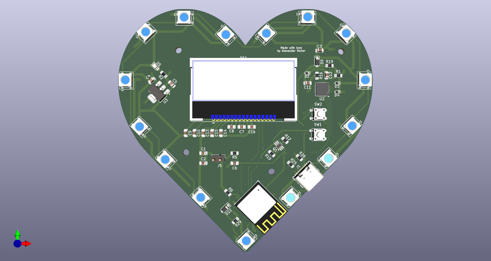

# HeartToHeart

HeartToHeart is a hardware project designed for IoT prototyping, featuring a custom PCB and ESP32 microcontroller. The project includes AWS IoT integration, a custom display, and a complete KiCad design for fabrication and assembly.

## Features
- Custom PCB design (KiCad)
- ESP32 microcontroller
- AWS IoT Core connectivity
- OLED display (NHD-C12832A1Z-FSW-FBW-3V3)
- Example firmware for secure WiFi and AWS IoT connection

## Directory Structure
- `pcb/` – KiCad project files and backups
- `src/` – Firmware source code and secrets templates
- `pcb/media/` – Project images and schematic PDF

## Getting Started
1. **Clone the repository**
2. Copy `src/secrets.example.h` to `src/secrets.h` and fill in your WiFi and AWS IoT credentials
3. Open `pcb/pcb.kicad_pro` in KiCad to view or modify the PCB
4. Generate your own fabrication files (Gerbers, drills, etc.) using KiCad's plot and export tools
5. Flash the firmware in `src/src.ino` to your ESP32

## Images

### PCB Layout

### Schematic

## License
See `pcb/License.txt` for licensing information.

---

**Note:** Do not commit your real `src/secrets.h` with credentials. Use `src/secrets.example.h` as a template.

**Important:** Fabrication files (Gerbers, drills, etc.) are not included in the repository. You must generate your own using the provided KiCad project files.
